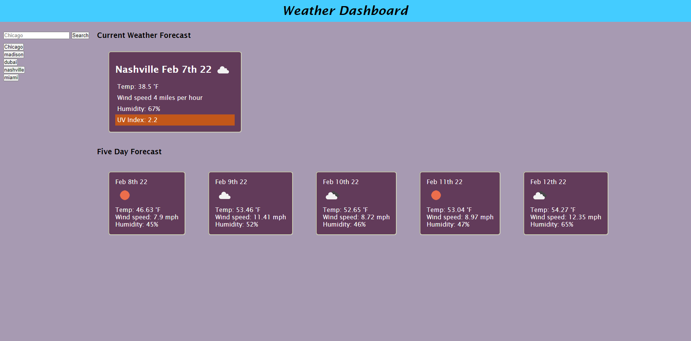

# hw6

## description

This project is a weather dashboard which receives data from a weather API. Searches are saved to local storage, and some items (UV index) are color coded based on the response. Both the current day and 5 day forecast are displayed, with images representing the weather for each day. Saved searches are put on the left hand side as buttons, which can be clicked to quickly review the weather for a location you have searched previously.

## screenshots

## links

\* Here is the link to the repo [jasonburke/repo] (https://github.com/Jasonsburke90/hw6)
\*Here is the link to the pages: [jasonburke/pages] (https://jasonsburke90.github.io/hw6/)
